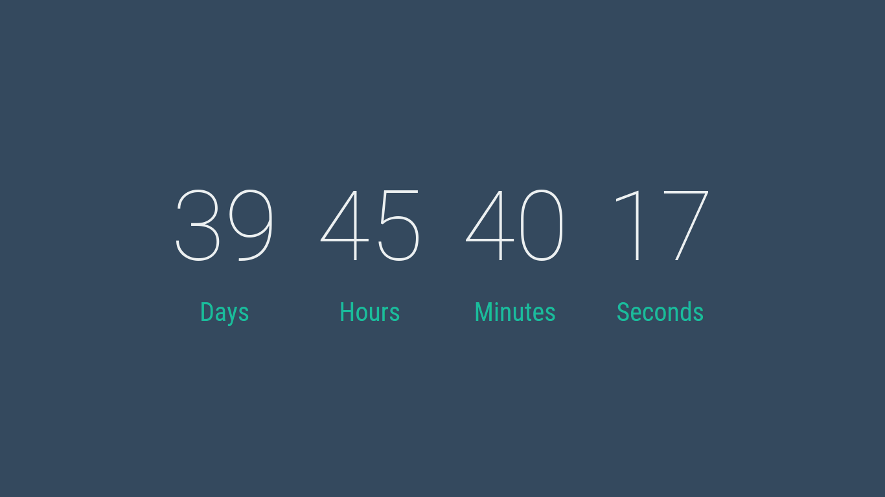

# countdown

> A Countdown timer using Vue.js

Do the following code

```html
<countdown date="August 15, 2016"></countdown>
```

to get a timer like this



For more details oh how the component was developed, checkout
[Countdown Timer using Vue.js](http://fareez.info/blog/countdown-timer-using-vuejs/)

## Build Setup

``` bash
# install dependencies
npm install

# serve with hot reload at localhost:8080
npm run dev

# build for production with minification
npm run build
```

For more information see the [docs for vueify](https://github.com/vuejs/vueify).
